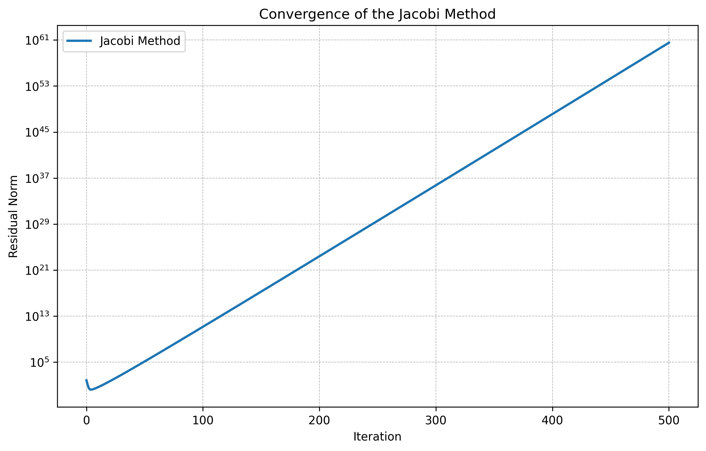

# Układy równań liniowych

Marta Kociszewska 198143

## 1. Wstęp
Celem projektu jest zaimplementowanie i porównanie iteracyjnych metod rozwiązywania układów równań liniowych
oraz metody faktoryzacji LU.

W ramach projektu zaimplementowane zostaną metody Jacobiego i Gaussa-Seidla, a także metoda faktoryzacji LU.

Zgodnie z wymaganiami **zadania A** skonstuwowano układ równań w postaci:
$$ Ax = b $$
gdzie:

- A - macierz systemowa

- b - wektor pobudzenia

- x - wektor rozwiązań

Macierz $A$ jest macierzą kwadratową o wymiarach $N \times N$, zawierającą pięć diagonalnych pasm, w której:

- główna diagonalna – elementy $a_1$, $a_1 = 5 + e$, gdzie $e$ to czwarta cyfra numeru indeksu, tutaj $e = 1$,

- dwie sąsiednie – elementy $a_2$ i $a_3$, $a_2 = a_3 = -1$.

Macierz $A$ ma postać:
$$
A = \begin{bmatrix}
a_1 & a_2 & a_3 & 0 & 0 & 0 & \cdots & 0 \\
a_2 & a_1 & a_2 & a_3 & 0 & 0 &\cdots & 0 \\
a_3 & a_2 & a_1 & a_2 & a_3  & 0 & \cdots & 0 \\
0 & a_3 & a_2 & a_1 & a_2 & a_3 & \cdots & 0 \\
\vdots & \vdots & \vdots & \vdots & \vdots & \vdots& \ddots & \vdots \\
0 & 0 & 0 & \cdots & \cdots& a_3 & a_2& a_1 \\
\end{bmatrix}
$$

Przyjmuje ona postać:
$$
A = \begin{bmatrix}
6 & -1 & -1 & 0 & \cdots & 0 \\
-1 & 6 & -1 & -1 & \cdots & 0 \\
-1 & -1 & 6 & -1& \cdots & 0 \\
0& -1 & -1 & 6 & \cdots & 0 \\
\vdots & \vdots & \vdots & \vdots & \ddots & \vdots \\
0 & 0 & 0 & \cdots & \cdots& 6 \\
\end{bmatrix}
$$

Macierz $b$ jest wektorem o wymiarach $N \times 1$, w którym n−ty element ma wartość $sin(n · (f + 1))$, gdzie $f$ to trzecia cyfra numeru indeksu, tutaj $f = 3$.

Wówczas wektor $b$ przyjmuje postać:
$$
b = \begin{bmatrix}
0.00000 \\
0.41212 \\
-0.75099 \\
0.95638 \\
\vdots \\
-0.93643 \\
\end{bmatrix}
$$

$N$ zostało obliczone wedługo wzoru:
$$ N = 1200 + 10c + d $$

gdzie: 

- $c$ - przedostatnia cyfra numeru indeksu, tutaj $c = 4$,

- $d$ - ostatnia cyfra numeru indeksu, tutaj $d = 3$.

Wówczas $$N = 1200 + 10 * 4 + 3 = 1243$$

## 2. Metody rozwiązywania układów równań liniowych

### 2.1.1 Metoda Jacobiego
Metoda Jacobiego jest jedną z najprostszych iteracyjnych metod rozwiązywania układów równań liniowych.
Jest to metoda iteracyjna, która polega na przekształceniu układu równań do postaci:
$$
x_i^{(k+1)} = \frac{1}{a_{ii}} \left( b_i - \sum_{j=1}^{i-1} a_{ij} x_j^{(k)} - \sum_{j=i+1}^{N} a_{ij} x_j^{(k)} \right)$$
gdzie:

- $x_i^{(k+1)}$ - wartość i-tej zmiennej w k-tej iteracji,

- $a_{ij}$ - element macierzy systemowej,

- $b_i$ - element wektora pobudzenia,

- $N$ - liczba zmiennych w układzie równań,

- $k$ - numer iteracji.

Metoda Jacobiego jest stosunkowo prosta do zaimplementowania, ale może być wolna w konwergencji, szczególnie dla dużych układów równań. Wymaga również, aby macierz systemowa była diagonalnie dominująca, aby zapewnić zbieżność metody.
W przypadku macierzy diagonalnie dominującej, metoda Jacobiego zbiega do rozwiązania układu równań liniowych.
W przeciwnym razie może nie zbiegać lub zbiegać bardzo wolno.

### 2.1.2 Metoda Jacobiego w postaci macierzowej
Metoda Jacobiego w postaci macierzowej polega na przekształceniu układu równań do postaci:
$$x^{(k+1)} = D^{-1}(L + U)x^{(k)} + D^{-1}b$$
którą można zapisać w postaci:
$$x^{(k+1)}=M_J x{(k)} + w_J$$
gdzie:

- $x^{(k+1)}$ - wektor rozwiązań w k-tej iteracji,

- $D$ - macierz diagonalna,

- $L$ - macierz dolnotrójkątna,

- $U$ - macierz górnotrójkątna,

- $b$ - wektor pobudzenia,

- $x^{(k)}$ - wektor rozwiązań w k-tej iteracji.

Metoda Jacobiego w postaci macierzowej jest bardziej złożona do zaimplementowania, ale może być szybsza w konwergencji, szczególnie dla dużych układów równań.

### 2.2.1 Metoda Gaussa-Seidla
Metoda Gaussa-Seidla jest ulepszoną wersją metody Jacobiego.
Jest to również metoda iteracyjna, która polega na przekształceniu układu równań do postaci:
$$
x_i^{(k+1)} = \frac{1}{a_{ii}} \left( b_i - \sum_{j=1}^{i-1} a_{ij} x_j^{(k+1)} - \sum_{j=i+1}^{N} a_{ij} x_j^{(k)} \right)$$
gdzie:

- $x_i^{(k+1)}$ - wartość i-tej zmiennej w k-tej iteracji,

- $a_{ij}$ - element macierzy systemowej,

- $b_i$ - element wektora pobudzenia,

- $N$ - liczba zmiennych w układzie równań,

- $k$ - numer iteracji.

Metoda Gaussa-Seidla jest szybsza od metody Jacobiego, ponieważ wykorzystuje już obliczone wartości zmiennych w bieżącej iteracji.
Jednak również wymaga, aby macierz systemowa była diagonalnie dominująca, aby zapewnić zbieżność metody.
W przypadku macierzy diagonalnie dominującej, metoda Gaussa-Seidla zbiega do rozwiązania układu równań liniowych.
W przeciwnym razie może nie zbiegać lub zbiegać bardzo wolno.

### 2.2.2 Metoda Gaussa-Seidla w postaci macierzowej
Metoda Gaussa-Seidla w postaci macierzowej polega na przekształceniu układu równań do postaci:
$$x^{(k+1)} = -(D + L)^{-1}U x^{(k)} + (D + L)^{-1}b$$
którą można zapisać w postaci:
$$x^{(k+1)}=M_{GS} x^{(k)} + w_{GS}$$
gdzie:

- $x^{(k+1)}$ - wektor rozwiązań w k-tej iteracji,

- $D$ - macierz diagonalna,

- $L$ - macierz dolnotrójkątna,

- $U$ - macierz górnotrójkątna,

- $b$ - wektor pobudzenia,

- $x^{(k)}$ - wektor rozwiązań w k-tej iteracji.

Metoda Gaussa-Seidla w postaci macierzowej jest bardziej złożona do zaimplementowania, ale może być szybsza w konwergencji, szczególnie dla dużych układów równań.

Aby zapewnić wydajność metody Gaussa-Seidla, czynnik $-(D+L)^{-1}(Ux^{(k)})$ będzie liczony w pętli jako $-T \text{ \ } (U*x)$, gdzie $T=(D+L)$.

### 2.3. Metoda bezpośrednia - faktoryzacja LU
Metoda faktoryzacji LU jest jedną z najczęściej stosowanych metod rozwiązywania układów równań liniowych.
Jest to metoda bezpośrednia, która polega na przekształceniu macierzy systemowej do postaci iloczynu dwóch macierzy:
$$
A = LU$$
gdzie:

- $L$ - macierz dolnotrójkątna,

- $U$ - macierz górnotrójkątna.

- $A$ - macierz systemowa.

Metoda faktoryzacji LU jest szybsza od metod iteracyjnych, ponieważ wymaga jedynie jednego przekształcenia macierzy systemowej do postaci iloczynu dwóch macierzy.
Jednak wymaga również, aby macierz systemowa była macierzą kwadratową i nieosobliwą, aby zapewnić istnienie faktoryzacji LU.
W przypadku macierzy kwadratowej i nieosobliwej, metoda faktoryzacji LU zbiega do rozwiązania układu równań liniowych.
W przeciwnym razie może nie zbiegać lub zbiegać bardzo wolno.

Rozwiązywanie układu równań liniowych za pomocą metody faktoryzacji LU składa się z dwóch kroków:

1. Faktoryzacja macierzy systemowej do postaci iloczynu dwóch macierzy:

   Wyznaczane są macierze trójkątne $L$ i $U$ zgodnie do wzoru:
   $$ A = L U$$

2. Rozwiązanie układu równań liniowych za pomocą macierzy dolnotrójkątnej i górnotrójkątnej.

   Polega na rozwiązaniu dwóch układów równań liniowych:

   1. Podstawienie w przód (ang. *forword substitution*) 
      $$ y = L ^{-1} (b)$$
   
   2. Podstawienie w tył (ang. *backward substitution*)
      $$ x = U^{-1}y$$

## 3. Analiza wyników dla zadanego układu równań

### 3.1. Metoda Jacobiego

Czas działania metody Jacobiego wyniósł w przyblieniu 2.8156 s, a liczba iteracji 44.

Oś Y przedstawia normę residuum, a oś X liczbę iteracji. Norma residuum jest w skali logarytmicznej, co pozwala na obserwację zmian wielkości residuum w czasie.
Norma residuum jest miarą błędu w obliczeniach i jest definiowana jako różnica między wartością rzeczywistą a wartością obliczoną. 
W przypadku metody Jacobiego norma residuum maleje w czasie, co oznacza, że metoda zbiega do rozwiązania układu równań liniowych.

Wykres wyraźnie pokazuje zbieżność metody Jacobiego. Norma residuum maleje monotonicznie wraz ze wzrostem liczby iteracji.
Spadek jest początkowo dość stromy, a następnie staje się łagodniejszy, co jest typowe dla metod iteracyjnych.

Metoda Jacobiego osiąga zadowalający poziom normy residuum po około 44 iteracjach.
Wartość normy residuum po 44 iteracjach wynosi około $10^{-6}$, co oznacza, że metoda Jacobiego zbiega do rozwiązania układu równań liniowych.

### 3.2. Metoda Gaussa-Seidla

Czas działania metody Gaussa-Seidla wyniósł w przyblieniu 3.7465 s, a liczba iteracji 25.

Oś Y (norma residuum) jest w skali logarytmicznej. 

Wykres również pokazuje zbieżność metody Gaussa-Seidla. Norma residuum maleje wraz z liczbą iteracji.
Podobnie jak w metodzie Jacobiego, spadek normy residuum jest szybszy na początku, a potem zwalnia.

Metoda Gaussa-Seidla osiąga zadowalający poziom normy residuum po około 25 iteracjach.
Wartość normy residuum po 25 iteracjach wynosi około $10^{-6}$, co oznacza, że metoda Gaussa-Seidla zbiega do rozwiązania układu równań liniowych.

### 3.3. Porównanie dwóch metod

Porównanie dwóch metod przedstawia poniższa tabela oraz wykres.

|     Metoda      | Czas działania (s) | Liczba iteracji  |
|:---------------:|:------------------:|:----------------:|
|    Jacobiego    |       3.0815       |        44        |
| Gaussa-Seidla  |       2.9794       |        25        |

Wnioski:

- Metoda Gaussa-Seidla jest szybsza od metody Jacobiego, zarówno pod względem czasu działania, jak i liczby iteracji.

- Obie metody zbieżne do rozwiązania układu równań liniowych, ale metoda Gaussa-Seidla osiąga zadowalający poziom normy residuum szybciej niż metoda Jacobiego.

- Obie metody są skuteczne w rozwiązywaniu układów równań liniowych, ale metoda Gaussa-Seidla jest bardziej efektywna w praktyce.

## 4. Analiza wyników alternatywnego układu równań

Zgodnie z wymaganiami **zadania C** skonstuwowano układ równań w postaci:
$$
A = \begin{bmatrix}
3 & -1 & -1 & 0 & \cdots & 0 \\
-1 & 3 & -1 & -1 & \cdots & 0 \\
-1 & -1 & 3 & -1& \cdots & 0 \\
0& -1 & -1 & 3 & \cdots & 0 \\
\vdots & \vdots & \vdots & \vdots & \ddots & \vdots \\
0 & 0 & 0 & \cdots & \cdots& 6 \\
\end{bmatrix}
$$

Macierz $b$ oraz $N$ pozostają bez zmian.

### 4.1. Metoda Jacobiego

Czas działania metody Jacobiego wyniósł w przyblieniu 23.3873 s, a liczba iteracji 500 - maksymalną możliwą ilość.

Mimo długiego czasu działania, norma residuum nie zbiega do zera, co oznacza, że metoda Jacobiego nie zbiega do rozwiązania układu równań liniowych.

### 4.2. Metoda Gaussa-Seidla

Czas działania metody Gaussa-Seidla wyniósł w przyblieniu 77.5113 s, a liczba iteracji 500 - maksymalną możliwą ilość.

Norma residuum nie zbiega do zera, co oznacza, że metoda Gaussa-Seidla nie zbiega do rozwiązania układu równań liniowych.

### 4.3. Porównanie dwóch metod

Porównanie dwóch metod przedstawia poniższa tabela oraz wykres.

|     Metoda      | Czas działania (s) | Liczba iteracji  |
|:---------------:|:------------------:|:----------------:|
|    Jacobiego    |       23.3873      |        500       |
| Gaussa-Seidla  |       77.5113      |        500       |

Wnioski:

- Obie metody nie zbieżne do rozwiązania układu równań liniowych.

- Obie metody wymagają maksymalnej liczby iteracji, aby zakończyć obliczenia.

- Obie metody są nieskuteczne w rozwiązywaniu układów równań liniowych w tej postaci.

## 4. Metoda bezpośrednia - faktoryzacja LU

Czas działania metody faktoryzacji LU wyniósł w przyblieniu 2.2226 s. 
Norma residuum wynosiła ok. $4.698 * 10^ {-15}$, rząd wielkości $10^{-15}$.

Metoda faktoryzacji LU radzi sobie znacznie lepiej niż metody iteracyjne.
Metoda ta jest też w tym przypadku znacznie szybsza od metod iteracyjnych, spowodowana jest to tym, że wymaga jedynie 
jednego przekształcenia macierzy systemowej do postaci iloczynu dwóch macierzy, a  metody Jacobiego oraz Gaussa-
Seidela, które nie zbiegają do rozwiązania, wykonują znacznie więcej operacji niż zazwyczaj powinny.
